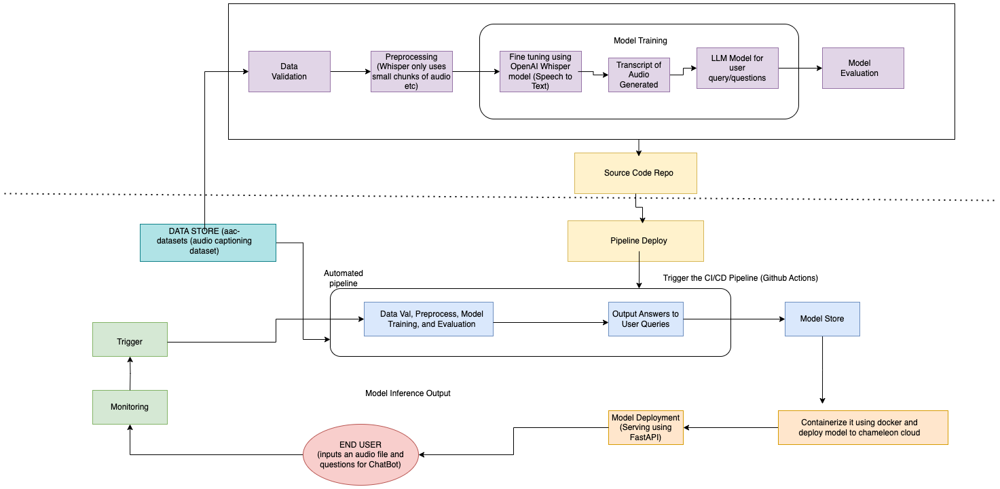

# STUDY BOT - Audio Captioning and Q/A Chatbot

## Group 48
### Value Proposition
Our proposed machine learning system aims to significantly enhance the learning experience for students by integrating ML models into existing EdTech platforms. For eg - 
1. Brightspace (Contains Video lectures)
2. NPTEL (University Learning system in India which contains a plethora of live video classes)

### Target Audience
The primary audience for this system is students—particularly those engaged in online or remote education via EdTech platforms, learning management systems (LMS), and educational apps. 

### Status Quo in Existing Services
Students must watch long, dense lecture videos to find relevant content, making learning inefficient. They often take notes, rewatch segments, or use external tools, leading to wasted time, cognitive overload, and missed information. 

Value Added by the Machine Learning System: Our system lets students skip full lectures and get instant answers via an LLM-powered chatbot.

**Key Benefits**
* Saves Time – Query specific concepts instantly. 
* Focused Learning – Access only relevant topics. 
* Better Retention – Structured, revisitable answers. 
* Inclusive – Supports diverse learning needs. 

### Customer Scale
On high-traffic days like finals at NYU, the Brightspace portal can experience up to 2000 students revisiting lecture content. With an average of 20 chatbot queries per student, this can result in over 40K requests in a single day—highlighting the need for a scalable and responsive system.

### Business Metrics for Evaluation 
* The impact and success of this system will be evaluated based on the following key business metrics: 
* User Adoption Rate: Number of students who actively use the Q&A feature after lecture uploads. 
* Time Saved: Average reduction in time spent per lecture by users who use the feature compared to those who don’t. 
* Engagement Metrics: Increase in student interaction, question frequency, and repeat usage. 
* Customer Retention and Satisfaction: Positive feedback from users and higher platform retention due to enhanced learning experiences.

### Contributors

<!-- Table of contributors and their roles. 
First row: define responsibilities that are shared by the team. 
Then, each row after that is: name of contributor, their role, and in the third column, 
you will link to their contributions. If your project involves multiple repos, you will 
link to their contributions in all repos here. -->

| Name                            | Responsible for | Link to their commits in this repo |
|---------------------------------|-----------------|------------------------------------|
| Amratanshu Shrivastava                   |   |  https://github.com/AmeyMittal/StudyBot-Audio-Captioning-and-Q-A-chatbot-/commits/main?author=amratanshu                                  |
| Amey Mittal                   |              |  https://github.com/AmeyMittal/StudyBot-Audio-Captioning-and-Q-A-chatbot-/commits/main?author=ameymittal                                  |
| Neha Patil                   |               |      https://github.com/AmeyMittal/StudyBot-Audio-Captioning-and-Q-A-chatbot-/commits/main?author=patilneha08                              |
| Ruchi Jha                     ||                                                    |

### System diagram

<!-- Overall digram of system. Doesn't need polish, does need to show all the pieces. 
Must include: all the hardware, all the containers/software platforms, all the models, 
all the data. -->

### Summary of outside materials

<!-- In a table, a row for each dataset, foundation model. 
Name of data/model, conditions under which it was created (ideally with links/references), 
conditions under which it may be used. -->

### 📚 Datasets and Models Used

| Item              | How it was Created                                                                                                                                                                                                                                                                                                           | Conditions of Use                                                                                                               |
|-------------------|------------------------------------------------------------------------------------------------------------------------------------------------------------------------------------------------------------------------------------------------------------------------------------------------------------------------------|----------------------------------------------------------------------------------------------------------------------------------|
| [NPTEL2020 Dataset](https://github.com/AI4Bharat/NPTEL2020-Indian-English-Speech-Dataset/blob/master/README.md) | A Speech-to-Text dataset created by AI4Bharat using lecture recordings from the NPTEL platform. Audio was segmented and manually transcribed. Clips with noise or poor quality were filtered out to ensure high transcription accuracy, representing diverse Indian English accents.                         | Released under a Creative Commons license for **research and educational use**.                                                |
| [Clotho Dataset](https://zenodo.org/records/3490684) ([Paper](https://arxiv.org/abs/1910.09387)) | A dataset for **audio captioning** (not speech-to-text), with 4,981 audio clips (15–30s) and 24,905 free-text captions (8–20 words). Audio is from Freesound, and captions are crowdsourced via Amazon Mechanical Turk. Post-processing removes named entities, speech, and uncommon words.                | Freely available for **research use**.                                                                                          |
| [Whisper (OpenAI)](https://github.com/openai/whisper) | A multilingual speech recognition model trained on 680,000 hours of web audio. Handles diverse accents, background noise, and both English and non-English speech using a transformer-based architecture for robust ASR performance.                                                                   | Released under the **MIT License** – free for **commercial and non-commercial** use with modification and distribution rights. |
| [LLaMA (Meta AI)](https://www.llama.com/) | A large transformer-based language model trained on open datasets (e.g., Wikipedia, Books, GitHub). Designed to be efficient and scalable, with several model sizes available.                                                                                                                           | Released under a **non-commercial research license** – only for **academic and research** use.                                 |

### Summary of infrastructure requirements

<!-- Itemize all your anticipated requirements: What (`m1.medium` VM, `gpu_mi100`), 
how much/when, justification. Include compute, floating IPs, persistent storage. 
The table below shows an example, it is not a recommendation. -->

| Requirement         | How many/when                                              | Justification |
|---------------------|------------------------------------------------------------|---------------|
| `m1.medium` VMs     | 3 for entire project duration                              | One for running RAG chatbot service, one for Whisper inference, one for managing background tasks like data cleanup and user feedback processing |
| `gpu_mi100`         | 4-hour block twice a week                                  | For fine-tuning Whisper on subsets of Clotho and NPTEL datasets; we expect occasional re-training based on feedback loop, so regular but not continuous GPU access is ideal |
| `gpu_a100`          | 8-hour block once every 2 weeks                            | For Llama-based RAG system experimentation and possible fine-tuning; high VRAM needed to support LLM context and embeddings |
| Floating IPs        | 1 for entire project duration, 1 for sporadic use          | One stable IP for API endpoint/chatbot, one temporary IP for occasional re-deployment or testing clusters |
| Block storage       | 500 GB for persistent storage                              | To store audio files, transcripts, processed feedback, embeddings, and logs across model runs |
| Object storage      | 2 TB total, expandable as needed                           | For storing raw audio (NPTEL subset), model checkpoints, and backups |
| Scheduled GPU jobs  | 2 per week (approx. 6–8 hours total)                       | Covers regular retraining and experimentation windows without overprovisioning GPUs |
| Feedback UI server  | Lightweight VM, active only after >100 transcription errors | Used occasionally to gather ground-truth transcript corrections from users |

### Detailed design plan

<!-- In each section, you should describe (1) your strategy, (2) the relevant parts of the 
diagram, (3) justification for your strategy, (4) relate back to lecture material, 
(5) include specific numbers. -->

<!-- Make sure to clarify how you will satisfy the Unit 4 and Unit 5 requirements, 
and which optional "difficulty" points you are attempting. -->

### Training and Re-Training Strategy

#### Whisper ASR Model

- **Initial Training**
  Fine-tuned on a combined dataset of [Clotho](https://zenodo.org/records/3490684) and a curated subset of [NPTEL2020](https://github.com/AI4Bharat/NPTEL2020-Indian-English-Speech-Dataset/blob/master/README.md) to adapt to Indo-English lecture audio.

- **Re-Training Trigger**
  Retraining is initiated when the system accumulates more than **100 incorrect transcripts**. Users are prompted to correct these transcripts, and their inputs are used as **new ground truth** for fine-tuning.

- **GPU Resources**
  `MI100` GPUs, in **4-hour blocks, twice a week**, are allocated for training and re-training tasks.

- **Experiment Tracking**
  All training runs, dataset versions, and fine-tuning iterations are logged using **MLflow** or **Weights & Biases (W&B)** for reproducibility and transparency.

---
#### LLaMA LLM (RAG System)

- **Primary Usage**:  
  LLaMA is used to answer user queries based on transcripts generated from lecture audio, powered by a **Retrieval-Augmented Generation (RAG)** pipeline.

- **Experimentation & Fine-Tuning**:  
  Embedding generation experiments or LLM fine-tuning are conducted using `A100` GPUs in **8-hour blocks, every two weeks**.

### Experiment Tracking & Training Infrastructure

#### Experiment Tracking

- **MLflow** will be used to log:
  - Model performance metrics
  - Inference speed
  - Chatbot accuracy over time

---

### 🗓️ Job Scheduling with Ray Cluster

- **Ray Cluster** will manage parallelized experimentation, especially for LLaMA-based workflows.
- **Hyperparameter tuning** (e.g., batch size, retrieval depth, learning rate) is handled via **Ray Tune**.
- **Ray Train** will be used during LLaMA fine-tuning to provide:
  - Fault tolerance
  - Model checkpointing
  - Scalable distributed training

---

### Scaling & Distributed Training

#### Whisper ASR Fine-Tuning

- **Distributed Data Parallel (DDP)** will be explored to accelerate training across multiple `MI100` GPUs.
- Experiments will compare training time and efficiency using:
  - Single GPU vs. Multi-GPU setups
  - Gradient accumulation
  - Mixed-precision training (FP16) for memory optimization

#### RAG System (LLaMA LLM)

- Potential fine-tuning on **lecture-specific datasets** to improve domain adaptation.
- **Ray Tune** will also be utilized here for hyperparameter optimization.

#### Model serving and monitoring platforms

<!-- Make sure to clarify how you will satisfy the Unit 6 and Unit 7 requirements, 
and which optional "difficulty" points you are attempting. -->

#### Data pipeline

<!-- Make sure to clarify how you will satisfy the Unit 8 requirements,  and which 
optional "difficulty" points you are attempting. -->

#### Continuous X

<!-- Make sure to clarify how you will satisfy the Unit 3 requirements,  and which 
optional "difficulty" points you are attempting. -->

