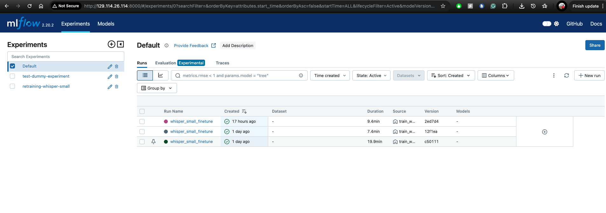

# Training and Infra

Provision VM server instance using -> https://github.com/AmeyMittal/StudyBot-Audio-Captioning-and-Q-A-chatbot-/blob/main/provisioning/create_vm_server.ipynb

Provision training instance (against an active GPU lease) using -> https://github.com/AmeyMittal/StudyBot-Audio-Captioning-and-Q-A-chatbot-/blob/main/provisioning/create_training_server.ipynb

The above jupyter also clones our github repo in the training instance.

In the training instance -> 
1. ssh into it
2. Pull the jupyter image using -> docker pull quay.io/jupyter/pytorch-notebook:cuda12-pytorch-2.5.1
3. Run a docker instance which uses the object storage (which has the dataset for training), with gpus using the command ->
docker run -d \
  -p 8888:8888 \
  --shm-size=8G \
  -e NPTEL_DIR=/mnt/nptel \
  --mount type=bind,source=/mnt/object,target=/mnt/nptel,readonly \
  -v /home/cc/StudyBot-Audio-Captioning-and-Q-A-chatbot-:/home/jovyan/work \
  --name torchnb \
  quay.io/jupyter/pytorch-notebook:cuda12-pytorch-2.5.1

In the github cloned directory in the instance ->

Navigate to the training folder -> https://github.com/AmeyMittal/StudyBot-Audio-Captioning-and-Q-A-chatbot-/tree/main/model-training

In this folder (in bash) ->

0. Pip install dependencies using ->
pip install -r requirements.txt

1. Prepare data 

python prepare_nptel_dataset.py

This will prepare the dataloaders using the complete dataset (87k wav and txt files) for quick access. This is doen so that we don't have to scan and process the dataset again and again for retraining.

2. Trigger Training

python train_whisper_small.py

3. Trigger retraining

python retraining.py

MLFLow and MinIO Object Store ->

Here’s what the MinIO “mlflow-artifacts” bucket looks like:

## Tracking Training runs ->

## Tracking Retraining runs ->

